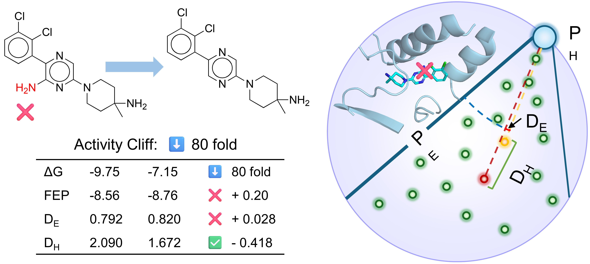

<h1 align="center">Learning Protein-Ligand Binding in Hyperbolic Space</h1>

<div align="center">

[](https://arxiv.org/abs/2508.15480)
[](https://aaai.org/conference/aaai/aaai-26/)
[](https://opensource.org/licenses/MIT)

</div>

<p align="center">
  
</p>

## ⚙ Installization

Clone the repository:
```bash
git clone https://github.com/jianhuiwemi/HypSeek.git
cd HypSeek
```
Install OpenBabel:
```bash
apt-get install -y openbabel
```
Install Python packages:
```bash
pip install numpy scikit-bio==0.6.2 rdkit biopandas
```
Install Uni-Core:
```bash
git clone https://github.com/dptech-corp/Uni-Core.git
cd Uni-Core
python setup.py install
cd ..
```
Install ProDy:
```bash
git clone https://github.com/prody/ProDy.git
cd ProDy
python setup.py build_ext --inplace --force
pip install -Ue .
cd ..
```
We also provide a full Conda environment file (`environment.yml`) for users who encounter dependency issues.


## 📦 Dataset & Checkpoints

We provide complete training data, test datasets, and all pretrained / finetuned model checkpoints. Please download them from [this link](https://drive.google.com/drive/folders/1uQNrN3tu0mrI1hhncu2MiKV7AYkqPslN?dmr=1&ec=wgc-drive-globalnav-goto).

### 📂 Datasets

The following datasets are included in the project root directory:

- `data.zip` — Training dataset  
- `test_datasets.zip` — Testing / benchmark datasets  

After downloading, extract them under the project root:

```
HypSeek/
 ├── data/
 └── test_datasets/
```

### 🧩 Model Checkpoints

We release both pre-trained weights and downstream-task finetuned models.

#### 1. `pretrain.zip` — Pre-trained Checkpoints

Contains the pretrained model weights used before downstream finetuning. Extract under:

```
HypSeek/pretrain/
```

#### 2. Finetuned Checkpoints (`Checkpoints/` directory)

| File | Purpose |
|------|---------|
| `checkpoint_avg_41-50_rk.pt` | **Affinity Ranking** |
| `checkpoint_avg_41-50_vs.pt` | **Virtual Screening** |

## 🚀 Quick Start

HypSeek can be directly evaluated using the provided `test.sh` script.

### ⚡ Run Virtual Screening

Use the **Screening checkpoint** (`checkpoint_avg_41-50_vs.pt`) for:

**DUD-E**
```bash
bash test.sh DUDE three_hybrid_model /path/checkpoint_avg_41-50_vs.pt ./results
```

**LIT-PCBA**
```bash
bash test.sh PCBA three_hybrid_model /path/checkpoint_avg_41-50_vs.pt ./results
```

### ⚡ Run Affinity Ranking
Use the **Ranking checkpoint** (`checkpoint_avg_41-50_rk.pt`) for FEP:

```bash
bash test.sh FEP three_hybrid_model /path/checkpoint_avg_41-50_rk.pt ./results
```

## 🏋️ Training

We provide a unified training script (`train.sh`). You may train either the **Virtual Screening (VS)** model or the **Affinity Ranking (RK)** model depending on the validation set used.

### 🔥 Train Virtual Screening Model

Use the **CASF** validation set:

```bash
bash train.sh CASF
```

### 🔥 Train Affinity Ranking Model

Use the **FEP** validation set:

```bash
bash train.sh FEP
```
## 📚 Citation

If you find this work useful in your research, please cite:

```bibtex
@misc{wang2025learningproteinligandbindinghyperbolic,
      title={Learning Protein-Ligand Binding in Hyperbolic Space}, 
      author={Jianhui Wang and Wenyu Zhu and Bowen Gao and Xin Hong and Ya-Qin Zhang and Wei-Ying Ma and Yanyan Lan},
      year={2025},
      eprint={2508.15480},
      archivePrefix={arXiv},
      primaryClass={cs.LG},
      url={https://arxiv.org/abs/2508.15480}, 
}
```

## 💐 Acknowledgments

This work builds upon [Uni-Mol](https://github.com/dptech-corp/Uni-Mol), [Uni-Core](https://github.com/dptech-corp/Uni-Core), and [LigUnity](https://github.com/IDEA-XL/LigUnity). We especially thank the LigUnity team for providing their data resources, and we thank all authors for their open-source contributions.

## 📬 Contact

For any questions or collaboration requests, please contact Jianhui:

📧 Email: [jianhuiwang309@gmail.com](mailto:jianhuiwang309@gmail.com)


